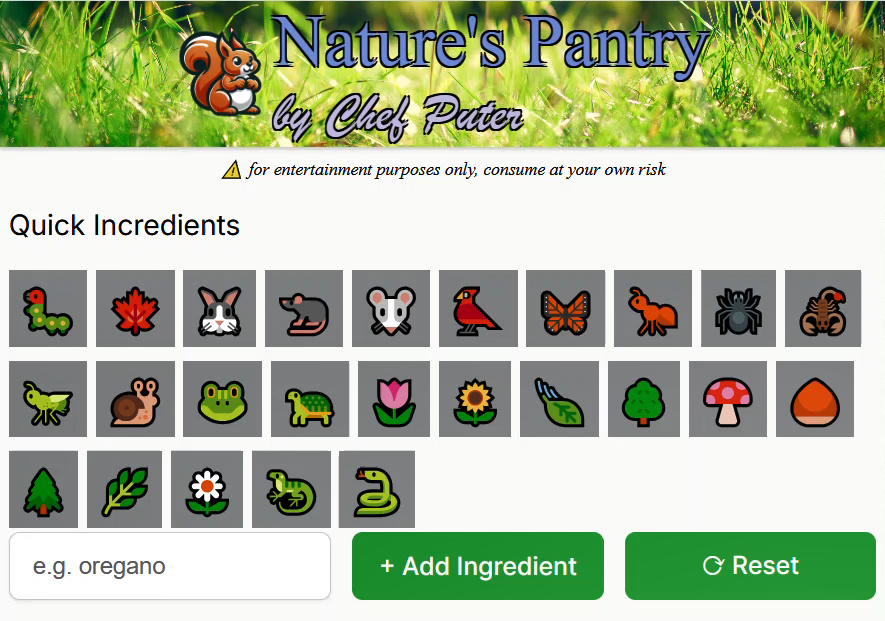

# 🌲 Nature's Pantry 😋




- [🌲 Nature's Pantry 😋](#-natures-pantry-)
  - [About](#about)
  - [Demo Site](#demo-site)
  - [Demo Video](#demo-video)
  - [Features](#features)
  - [Setup](#setup)
  - [Architecture Design](#architecture-design)
    - [Data Flow](#data-flow)
    - [State Management](#state-management)
  - [External Services](#external-services)
  - [References](#references)

## About
Nature's Pantry is a straightforward web application where users can add ingredients to a list and generate recipes. This project was created to demonstrate the capabilities of React and Vite.

Artificial intelligence is used to generate recipes based on the ingredients provided by the user. 

Nature's Pantry leverages cutting-edge web development tools and practices to provide a responsive and interactive user experience. React enables a modular and maintainable codebase, while Vite offers a fast and efficient development environment.

The application demonstrates how to manage state in a React component and interact with external services to generate dynamic content. The use of components facilitates easy reuse and composability, simplifying the addition of new features or modification of existing ones.

The responsive design ensures the application is accessible on various devices, providing a consistent user experience across different screen sizes. The incorporation of AI to generate recipes adds an element of interactivity and engagement, making the application more enjoyable to use.

Overall, Nature's Pantry effectively showcases the power of React and Vite in creating modern and engaging user interfaces.

## Demo Site
Access the [Nature's Pantry](http://kathleenwest.github.io/nature-pantry-ai-recipe-app) web application and try the features.

## Demo Video
Watch the [Nature's Pantry - Short Marketing Demo Video](https://youtube.com/shorts/uv9ClVK1ZCw) see the application in action.

Watch the [Nature's Pantry - Demo Video](https://youtu.be/RV6-eI0bBwg) (larger) to see the application in action.


## Features
- Add ingredients to a list
- Generate a recipe based on the ingredients in the list
- Responsive design
- Quick and easy to use
- Artificial intelligence

## Setup
Install the dependencies and run the project
```sh
npm install
npm start
```

Head over to [Vite](https://vitejs.dev/) to learn more about configuring Vite.

## Architecture Design
The application follows a component-based architecture using React. Below is an overview of the main components and their responsibilities:

- **App.jsx**: The root component that includes the `Header`, `Main`, and `Footer` components.
- **Header.jsx**: Displays the header section with the application logo and title.
- **Main.jsx**: The main content area where users can add ingredients and generate recipes.
  - **IngredientsList.jsx**: Displays the list of ingredients added by the user.
  - **Recipe.jsx**: Displays the generated recipe in markdown format.
  - **QuickIngredients.jsx**: Provides a list of quick ingredients that users can add with a single click.
  - **ButtonList.jsx**: Renders a list of buttons for quick ingredients.
  - **Button.jsx**: A reusable button component used in the `ButtonList`.
- **Footer.jsx**: Displays the footer section with a link to the creator's portfolio.

### Data Flow
1. **Adding Ingredients**: Users can add ingredients through the input form or by clicking on quick ingredient buttons. The ingredients are stored in the state of the `Main` component.
2. **Generating Recipes**: When users click the "Get a recipe" button, the application sends a request to an AI service to generate a recipe based on the ingredients. The response is then displayed in the `Recipe` component.
3. **Resetting Ingredients**: Users can reset the list of ingredients and the generated recipe by clicking the "Reset" button.

### State Management
State management is handled using React's `useState` hook within the `Main` component. The state includes:
- `ingredients`: An array of ingredients added by the user.
- `recipe`: The generated recipe in markdown format.
- `loadingRecipe`: A boolean indicating whether the recipe is being loaded.

## External Services
The application interacts with an external AI service, Puter, to generate recipes based on the ingredients provided by the user. Users need to authenticate (seemless) with Puter via a pop-up window (freemium) to use the AI services.

## References
Inspired by [Scrimba](https://scrimba.com/) course [Learn React](https://scrimba.com/learn-react-c0e)
